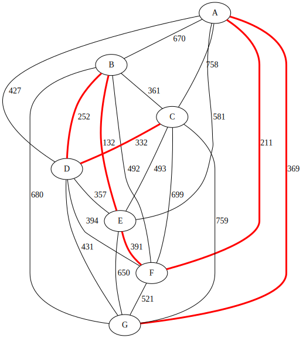

# Kruskal-algorithm
Simple implementation of Kruskal algorithm for finding minimal binding tree

## Dane wejściowe

Ze względu na specyfikę zadania dane zostały wpisane do programu na sztywno w postaci zbioru krawędzi.
 
```c
vector<Krawedz> dostepne_krawedzie {
		Krawedz(1,2,670),Krawedz(1,3,758),Krawedz(1,4,427),Krawedz(1,5,581),Krawedz(1,6,211),Krawedz(1,7,369),
		Krawedz(2,3,361),Krawedz(2,4,252),Krawedz(2,5,132),Krawedz(2,6,492),Krawedz(2,7,680),
		Krawedz(3,4,332),Krawedz(3,5,493),Krawedz(3,6,699),Krawedz(3,7,759),
		Krawedz(4,5,357),Krawedz(4,6,394),Krawedz(4,7,431),
		Krawedz(5,6,391),Krawedz(5,7,650),
		Krawedz(6,7,521)
		};
```

## Struktury danych
Grafy zapisywane są w programie jako wektory krawędzi. Strukturę Krawedz charakteryzuje numer węzła początkowego, końcowego i waga. Dla klasy Krawedz została zdefiniowana relacja większości, pozwalająca na sortowanie krawędzi wg ich wag.
Dane wejściowe dla algorytmu (pełny graf) znajduje się w wektorze krawędzi `dostępne_krawedzie`.
Krawędzie tworzące wyjściowe drzewo będą zapisywane do wektora krawędzi `wybrane_krawedzie`.
Fakt istnienia ścieżki łączącej dwa węzły zapisywany jest w strukturze typu Polaczenie. Klasa ta udostępnia dwie metody:
- `bool czy_polaczone(int,int)` - zwracającą wartość logiczną prawda, gdy istnieje połączenie między węzłami, których numery podano jako argumenty wywołania
- `bool polacz(int, int)` - zapisująca w strukturze połączenie między węzłami, których numery podano jako numer wywołania algorytmu. W sposób rekurencyjny tworzone są też zapisy o połączeniach, które pojawiły w wyniku wywołania.
## Algorytm
Pierwszym krokiem algorytmu jest posortowanie krawędzi wyjściowego grafu.
`sort(dostepne_krawedzie.begin(), dostepne_krawedzie.end());`

Następnie w pętli przebiegającej cały wektor krawędzi grafu wyjściowego dostępne_krawedzie, w kolejności rosnących wag, dodawane są nowe krawędzie do wybrane_krawedzie. Dodanie uwarunkowane jest nie istnieniem połączenia między węzłami danej krawędzi. Gdy spełniony jest ten warunek zapisywana jest także informacja o powstaniu nowego połączenia. Ze względu na późniejszy sposób zapisu plików w wyjściowym grafie oznaczane są wybrane krawędzie.
```c
for (auto &k : dostepne_krawedzie)
        if (!p.czy_polaczone(k.poczatek,k.koniec)){ // jesli nie zamkniemy cyklu
			cout << k ;
			p.polacz(k.poczatek,k.koniec);
			k.wybrane=1;
			wybrane_krawedzie.push_back(k);
		}
```

Algorytm kończy się w momencie, kiedy sprawodzone są wszystkie krawędzie. W przypadku większej ich liczby mogłoby być uzasadnione sprawdzanie innego warunku zakończenia, w postaci kontroli istnienia połączeń pomiędzy wszystkimi węzłami.
Ostatnim etapem działania programu jest obliczenie sumarycznej długości drzewa, oraz zapis grafów do plików. Operacje te zrealizowane są dzięki odpowiedniemu przeciążeniu operatorów dla klasy Krawedz.

## Wynik
Program zapisuje strukturę znalezionego drzewa rozpinającego oraz pełny graf do plików w formacie DOT. Zwizualizować graf można wykonane przy pomocy narzędzia [GraphvizOnline](https://dreampuf.github.io/GraphvizOnline/#graph%20G%20%7B%0D%0AB--E%20%5Blabel%3D%22%20132%22%20penwidth%3D3%20color%3Dred%5D%0D%0AA--F%20%5Blabel%3D%22%20211%22%20penwidth%3D3%20color%3Dred%5D%0D%0AB--D%20%5Blabel%3D%22%20252%22%20penwidth%3D3%20color%3Dred%5D%0D%0AC--D%20%5Blabel%3D%22%20332%22%20penwidth%3D3%20color%3Dred%5D%0D%0AD--E%20%5Blabel%3D%22%20357%22%20penwidth%3D1%20color%3Dblack%5D%0D%0AB--C%20%5Blabel%3D%22%20361%22%20penwidth%3D1%20color%3Dblack%5D%0D%0AA--G%20%5Blabel%3D%22%20369%22%20penwidth%3D3%20color%3Dred%5D%0D%0AE--F%20%5Blabel%3D%22%20391%22%20penwidth%3D3%20color%3Dred%5D%0D%0AD--F%20%5Blabel%3D%22%20394%22%20penwidth%3D1%20color%3Dblack%5D%0D%0AA--D%20%5Blabel%3D%22%20427%22%20penwidth%3D1%20color%3Dblack%5D%0D%0AD--G%20%5Blabel%3D%22%20431%22%20penwidth%3D1%20color%3Dblack%5D%0D%0AB--F%20%5Blabel%3D%22%20492%22%20penwidth%3D1%20color%3Dblack%5D%0D%0AC--E%20%5Blabel%3D%22%20493%22%20penwidth%3D1%20color%3Dblack%5D%0D%0AF--G%20%5Blabel%3D%22%20521%22%20penwidth%3D1%20color%3Dblack%5D%0D%0AA--E%20%5Blabel%3D%22%20581%22%20penwidth%3D1%20color%3Dblack%5D%0D%0AE--G%20%5Blabel%3D%22%20650%22%20penwidth%3D1%20color%3Dblack%5D%0D%0AA--B%20%5Blabel%3D%22%20670%22%20penwidth%3D1%20color%3Dblack%5D%0D%0AB--G%20%5Blabel%3D%22%20680%22%20penwidth%3D1%20color%3Dblack%5D%0D%0AC--F%20%5Blabel%3D%22%20699%22%20penwidth%3D1%20color%3Dblack%5D%0D%0AA--C%20%5Blabel%3D%22%20758%22%20penwidth%3D1%20color%3Dblack%5D%0D%0AC--G%20%5Blabel%3D%22%20759%22%20penwidth%3D1%20color%3Dblack%5D%0D%0A%7D).


